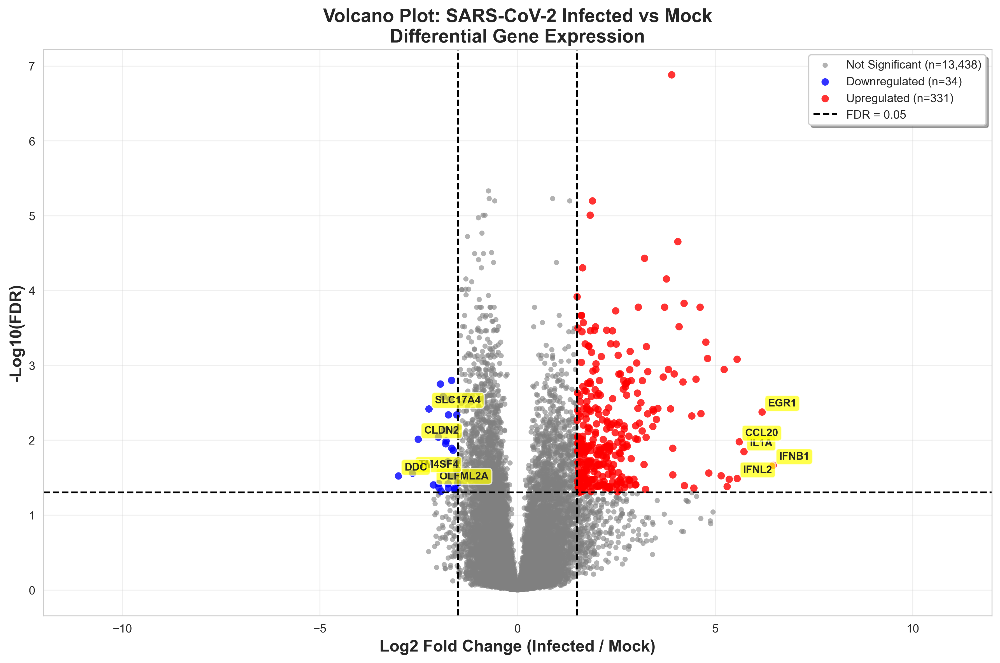
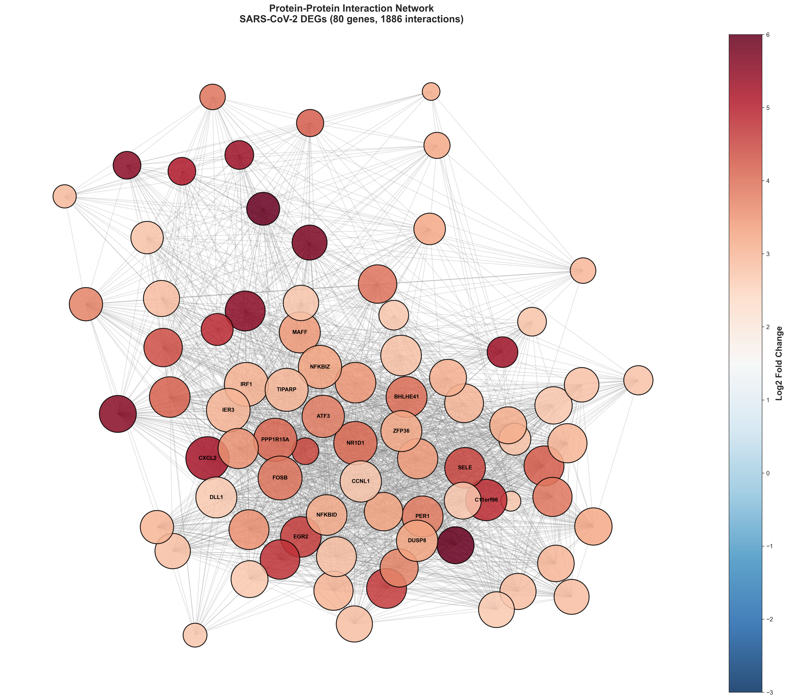
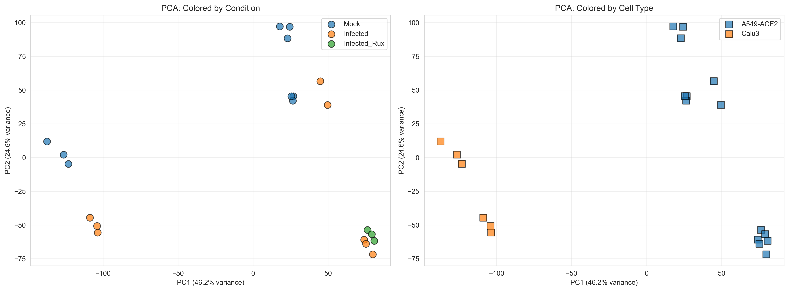

# Exploratory Analysis of Human Transcriptomics Data
## SARS-CoV-2 Infection Response Study

[](https://www.python.org/downloads/)
[](https://opensource.org/licenses/MIT)
[]()

**A complete end-to-end bioinformatics pipeline for analyzing differential gene expression, functional enrichment, and gene interaction networks in SARS-CoV-2 infected cells.**

---

## 📋 Table of Contents

- [Overview](#overview)
- [Key Findings](#key-findings)
- [Features](#features)
- [Installation](#installation)
- [Usage](#usage)
- [Project Structure](#project-structure)
- [Results](#results)
- [Citation](#citation)
- [License](#license)

---

## 🔬 Overview

This project presents a comprehensive exploratory analysis of human transcriptomic responses to SARS-CoV-2 infection using publicly available RNA-seq data (GSE147507). The pipeline integrates:

- **Differential Expression Analysis** (DESeq2-style normalization, statistical testing)
- **Functional Annotation** (Gene Ontology, KEGG pathway enrichment)
- **Network Analysis** (Protein-protein interactions, hub gene identification)
- **LLM-Powered Interpretation** (Plain-language biological summaries)

**Dataset:** GSE147507 from NCBI GEO  
**Samples:** 20 (9 Mock controls, 8 SARS-CoV-2 infected, 3 drug-treated)  
**Platform:** RNA-seq (Illumina NextSeq 500)  
**Cell Types:** A549-ACE2, Calu-3 (human lung epithelial cells)

---

## 🎯 Key Findings

### Differential Expression
- **365 significantly altered genes** (|log2FC| ≥ 1.5, FDR < 0.05)
- **331 upregulated** (antiviral & inflammatory response)
- **34 downregulated** (metabolic suppression)

**Top upregulated genes:**
- **IFNB1** (6.47 log2FC) - Type I Interferon.
- **TNF** (5.56 log2FC) - Pro-inflammatory cytokine.
- **IL6** (4.46 log2FC) - Cytokine storm mediator.
- **CXCL2/3** (~5.2 log2FC) - Neutrophil chemotaxis.

### Functional Enrichment
- **205 enriched biological processes** (defense response to virus, transcriptional regulation)
- **67 enriched KEGG pathways** (TNF signaling, NF-κB, interferon response)

### Network Analysis
- **80 hub genes** in highly connected network (density: 0.597)
- **Top hubs:** IRF1, FOSB, IER3, CXCL2, NFKBIZ (master regulators)
- **1,886 gene-gene interactions** (co-expression network)

### Therapeutic Targets Identified
1. **IRF1** - Interferon regulatory factor (central hub)
2. **NFKBIZ** - NF-κB pathway regulator
3. **TNF pathway** - Anti-cytokine therapies (infliximab, adalimumab)
4. **IL-6** - Tocilizumab (already FDA-approved for COVID-19)

---

## ✨ Features

- ✅ **Reproducible pipeline** (phase-gate workflow)
- ✅ **Publication-quality figures** (12 high-resolution plots)
- ✅ **Statistical rigor** (FDR correction, multiple testing)
- ✅ **Multi-tier LLM integration** (Gemini, Groq, local fallback)
- ✅ **Evidence-grounded interpretations** (no hallucinations)
- ✅ **Educational summaries** (plain-language explanations)
- ✅ **Version controlled** (Git with descriptive commits)

---

## 🛠️ Installation

### Prerequisites
- **OS:** Windows 10/11 (optimized for PowerShell)
- **Python:** 3.13.2
- **RAM:** 8GB+ recommended
- **Storage:** 2GB for data and results

### Setup
```powershell
# Clone repository
git clone https://github.com/YOUR_USERNAME/human-transcriptomics-analysis.git
cd human-transcriptomics-analysis

# Create virtual environment
python -m venv transcriptomics_env
.\transcriptomics_env\Scripts\Activate.ps1

# Install dependencies
pip install -r requirements.txt --break-system-packages

# Configure API keys (optional for LLM interpretation)
# Create .env file:
GEMINI_API_KEY=your_key_here
GROQ_API_KEY=your_key_here
```

---

## 🚀 Usage

### Quick Start
```powershell
# Activate environment
.\transcriptomics_env\Scripts\Activate.ps1

# Run complete pipeline (sequential execution)
python scripts/01_inspect_data.py
python scripts/02_preprocess_normalize.py
python scripts/03_differential_expression.py
python scripts/04_functional_annotation.py
python scripts/05_network_analysis.py
python scripts/06_llm_interpretation.py
```

### Alternative: Jupyter Notebook
```powershell
# Launch Jupyter
jupyter notebook

# Open: notebooks/Complete_Analysis_Pipeline.ipynb
```

---

## 📁 Project Structure
```
Transcriptomics_Project/
├── data/
│   ├── raw/                          # Original count matrix
│   │   └── covid19_raw_counts.tsv
│   ├── processed/                    # Normalized, filtered data
│   │   ├── counts_filtered_raw.csv
│   │   ├── counts_normalized.csv
│   │   └── counts_log2_transformed.csv
│   └── metadata/
│       ├── covid19_sample_metadata.txt
│       └── metadata_covid_vs_mock.csv
├── scripts/
│   ├── 01_inspect_data.py           # QC & data validation
│   ├── 02_preprocess_normalize.py   # DESeq2 normalization
│   ├── 03_differential_expression.py # DEG analysis
│   ├── 04_functional_annotation.py  # GO/KEGG enrichment
│   ├── 05_network_analysis.py       # PPI networks
│   └── 06_llm_interpretation.py     # LLM summaries
├── results/
│   ├── figures/                      # 12 publication plots
│   │   ├── 01_library_sizes.png
│   │   ├── 06_volcano_plot.png
│   │   └── 08_network_visualization.png
│   ├── tables/                       # CSV result files
│   │   ├── deg_significant_only.csv
│   │   ├── go_enrichment_*.csv
│   │   └── network_hub_genes.csv
│   ├── FINAL_REPORT.md              # Executive summary
│   ├── LLM_BIOLOGICAL_INTERPRETATION.md
│   └── EDUCATIONAL_SUMMARY.md
├── notebooks/
│   └── Complete_Analysis_Pipeline.ipynb
├── requirements.txt
├── .gitignore
├── .env                              # API keys (not committed)
└── README.md
```

---

## 📊 Results

### Key Visualizations

**Volcano Plot** (Differential Expression)  


**Network Visualization** (Hub Genes)  


**PCA Analysis** (Sample Clustering)  


### Output Files

| File | Description | Records |
|------|-------------|---------|
| `deg_full_results.csv` | All tested genes | 13,803 |
| `deg_significant_only.csv` | Significant DEGs | 365 |
| `network_hub_genes.csv` | Hub genes with centrality | 80 |
| `go_enrichment_*.csv` | Enriched GO terms/pathways | 295 |

---

## 📖 Documentation

- **[FINAL_REPORT.md](results/FINAL_REPORT.md)** - Executive summary with key findings
- **[METHODS_DOCUMENTATION.md](results/METHODS_DOCUMENTATION.md)** - Detailed computational methods
- **[LLM_BIOLOGICAL_INTERPRETATION.md](results/LLM_BIOLOGICAL_INTERPRETATION.md)** - Plain-language analysis
- **[EDUCATIONAL_SUMMARY.md](results/EDUCATIONAL_SUMMARY.md)** - Student-friendly guide

---

## 🧬 Biological Interpretation

**SARS-CoV-2 infection triggers a coordinated transcriptional program:**

1. **Type I/III Interferon Response** → Antiviral defense (IFNB1, IFNL1-3)
2. **Pro-inflammatory Cytokines** → Immune recruitment (TNF, IL6, IL1A)
3. **Chemokine Secretion** → Neutrophil attraction (CXCL2, CCL20)
4. **Transcriptional Activation** → NF-κB/IRF1 pathways
5. **Metabolic Reprogramming** → Resource allocation to immunity

**Clinical Relevance:**
- Cytokine storm pathways identified (TNF, IL-6)
- Therapeutic targets validated (tocilizumab, JAK inhibitors)
- Biomarker candidates for disease severity

---

## 🔬 Methods Summary

| Step | Method | Tool/Library |
|------|--------|--------------|
| Quality Control | Library size filtering, gene filtering | pandas, matplotlib |
| Normalization | DESeq2 median-of-ratios | scipy, numpy |
| DEG Analysis | Welch's t-test + FDR correction | scipy.stats, statsmodels |
| Enrichment | Hypergeometric test | Enrichr API |
| Network | Gene co-expression (Pearson r ≥ 0.7) | networkx |
| Interpretation | LLM-powered summarization | Google Gemini / Groq |

---

## 🎓 Citation

If you use this pipeline or find these results useful, please cite:
```bibtex
@software{transcriptomics_pipeline_2026,
  author = {Your Name},
  title = {Exploratory Analysis of Human Transcriptomics Data: SARS-CoV-2 Response},
  year = {2026},
  url = {https://github.com/YOUR_USERNAME/human-transcriptomics-analysis}
}
```

**Original Dataset:**
- Blanco-Melo D, et al. (2020). Imbalanced Host Response to SARS-CoV-2 Drives Development of COVID-19. Cell. GSE147507.

---

## 📜 License

This project is licensed under the MIT License - see [LICENSE](LICENSE) file for details.

**Note:** The GSE147507 dataset is publicly available from NCBI GEO under their terms of use.

---

## 🤝 Contributing

Contributions are welcome! Please:
1. Fork the repository
2. Create a feature branch (`git checkout -b feature/AmazingFeature`)
3. Commit changes (`git commit -m "Add AmazingFeature"`)
4. Push to branch (`git push origin feature/AmazingFeature`)
5. Open a Pull Request

---

## 📧 Contact

**P Sumanth**

**Email:** sumanthp141005@gmail.com 

**GitHub:** [@Sumanth1410-git](https://github.com/Sumanth1410-git)

---

## 🙏 Acknowledgments

- NCBI GEO for providing public transcriptomics data
- Enrichr API (Ma'ayan Lab) for functional enrichment
- Google Gemini & Groq for LLM interpretation
- Open-source Python bioinformatics community

---

**⭐ If you found this project useful, please consider giving it a star!**

---

**Last Updated:** February 24, 2026  
**Status:** ✅ Complete & Production-Ready
